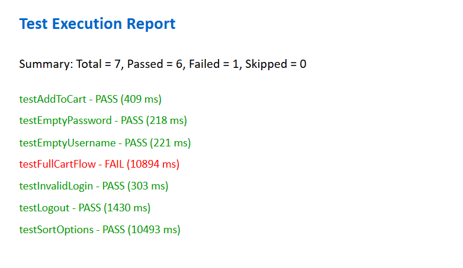

# 🚀 SauceDemo E-Commerce Automation Framework
## This project is a Selenium TestNG Automation Framework designed to fully test the SauceDemo E-commerce website with advanced features such as automated PPT test reporting with execution time, colorful status indicators (Pass/Fail), and a summary of test results.

## ✅ Project Overview
This framework automates and tests all critical functionalities of SauceDemo, a demo online shopping platform. It includes functional testing, negative testing, checkout flow testing, and UI element verifications.

This project covers everything from basic login tests to advanced purchase flow automation and generates a PowerPoint report with colorful test statuses and execution time for every test, all inside a single slide for better readability.

## 🧩 Key Features
✅ Login Tests:- Test valid login, invalid login, empty username, empty password cases.
🛒 Cart & Checkout Flow:- Add/remove items, checkout, cancel/resume flow, order confirmation.
🔄 Sort Functionality Test:- Tests sorting products by Name (A-Z, Z-A) and Price (Low to High, High to Low).
⏱️ Execution Time Tracking:- Displays how long each test took.
📝 PowerPoint Test Report:- Generates a colorful, single-slide PPT report with Pass/Fail status, execution time & summary.

## 🏷️ Technologies Used
Java 24,
Selenium WebDriver 4.21.0,
TestNG 7.10.1,
Apache POI (for generating PPT reports),
Maven (for dependency management),
IntelliJ IDEA (for development),
Google Chrome Driver

## 🛠️ Problems Faced & Solutions
### 1. Driver Compatibility Issues
Problem: Selenium couldn’t detect the correct ChromeDriver for my Chrome version.

Solution: Used Selenium Manager to auto-detect the right driver and kept the latest ChromeDriver in the project /drivers/ folder to avoid mismatches.

### 2. Test Flakiness Due to Page Load Delays
Problem: Elements weren't loading in time causing NoSuchElementException.

Solution: Added WebDriverWait (Explicit Waits) instead of Thread.sleep() to make tests reliable and more professional.

### 3. Duplicate & Cluttered Reports
Problem: Initially, every test was generating a separate PPT slide making the report cluttered.

Solution: Redesigned the reporting logic to generate a single-slide PPT report with colorful statuses and clear test summaries.

### 4. TestNG Listener Configuration
Problem: TestNG listeners weren't working as expected in IntelliJ.

Solution: Added proper @Listeners annotation to bind the report generator class correctly with the test classes.

### 5. Execution Time Calculation
Problem: Capturing test start/end time precisely for all cases.

Solution: Used System.currentTimeMillis() at start & end of each test and calculated duration in seconds with milliseconds precision.

## 📊 Sample PowerPoint Report (Auto-Generated)
✅ Test Name
✅ Status with Color: Green (Pass), Red (Fail), Yellow (Skipped/Warnings)
✅ Execution Time per Test
✅ Overall Summary
✅ Compact & Single Slide Format (like HTML reports but in PPTX)




## Clone the repository
```
git clone https://github.com/ParamSunny/SauceDemo.git
```
### Import as Maven Project in IntelliJ IDEA
### Execute tests using TestNG

## 🔥 Future Improvements
Integrate Email Report Sharing,
Support Cross-Browser Testing (Firefox, Edge),
Generate HTML + PPT reports simultaneously,
CI/CD Integration (GitHub Actions / Jenkins)

## 📄 License
This project is licensed under the MIT License.

## 🚨 Final Note:
This project not only automates basic test cases but also delivers a professional QA reporting experience by combining Selenium, TestNG, and Apache POI together in a production-ready PPT reporting solution.

